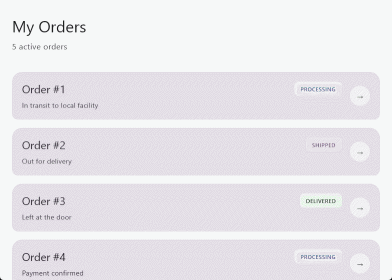
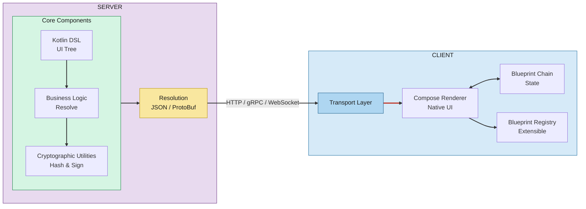

# Blueprint

**Server-Driven UI (SDUI) / Backend-Driven UI (BDUI) framework for Kotlin Multiplatform (KMP).**



Blueprint is an enterprise-grade framework that shifts UI rendering control to the backend. Instead of hardcoding
screens in your mobile or desktop app, you describe the entire UI tree—layout, components, styling, and interactions—as
serializable data models. The server delivers these blueprints at runtime, and the client renders them natively using
Jetpack Compose.

This enables instant UI updates without app store releases, centralized business logic, and a cryptographically
verifiable chain of state for zero-trust architectures.

---

## Table of Contents

- [Architecture Overview](#architecture-overview)
- [Module Structure](#module-structure)
- [Key Concepts](#key-concepts)
    - [Blueprint & BlueprintNode](#blueprint--blueprintnode)
    - [Dynamic Values (State Binding)](#dynamic-values-state-binding)
    - [Component Payloads](#component-payloads)
    - [Modifiers](#modifiers)
    - [Intents & Effects](#intents--effects)
    - [State Delta Blocks](#state-delta-blocks)
    - [BlueprintChain (Zero-Trust)](#blueprintchain-zero-trust)
- [Server-Side Usage](#server-side-usage)
    - [Creating a Blueprint (Kotlin DSL)](#creating-a-blueprint-kotlin-dsl)
    - [Handling Intents & Generating Resolutions](#handling-intents--generating-resolutions)
    - [ProtoBuf Serialization](#protobuf-serialization)
- [Client-Side Usage](#client-side-usage)
    - [Rendering a Blueprint (Compose)](#rendering-a-blueprint-compose)
    - [Dispatching Intents](#dispatching-intents)
    - [Managing the Chain State](#managing-the-chain-state)
- [Extensibility](#extensibility)
    - [Custom Components & Renderers](#custom-components--renderers)
- [Real-World Example](#real-world-example)
- [Getting Started](#getting-started-tbd-)

---

## Architecture Overview



The server owns the UI definition and state. The client is a thin rendering layer that translates data into native
components and sends user interactions back as intents.

---

## Module Structure

| Module             | Description                                                                                                                          |
|--------------------|--------------------------------------------------------------------------------------------------------------------------------------|
| `runtime`          | Core data models: `Blueprint`, `BlueprintNode`, component payloads, `Intent`, `Effect`, `Dynamic*` types. Pure Kotlin Multiplatform. |
| `dsl`              | Type-safe Kotlin DSL for building UI trees on the server side.                                                                       |
| `renderer`         | Abstract rendering interface and `CompositionLocal` providers (state, intent handler, error handler).                                |
| `renderer-compose` | Jetpack Compose implementation: renders all layout and Material components from blueprints.                                          |
| `chain`            | Cryptographic `BlueprintChain` for zero-trust state management with hash verification and delta patching.                            |
| `protocol`         | ProtoBuf schema definitions for all models.                                                                                          |

---

## Key Concepts

### Blueprint & BlueprintNode

A `Blueprint` is the top-level container describing a screen:

```kotlin
@Serializable
data class Blueprint(
    val id: String,
    val version: String = "1.0",
    val metadata: BlueprintMetadata? = null,
    val state: Map<String, String> = emptyMap(),
    val root: BlueprintNode,
    val hash: String = "",
    val previousHash: String? = null
)
```

The UI tree is built from recursive `BlueprintNode`s:

```kotlin
@Serializable
data class BlueprintNode(
    val key: String,
    val payload: ComponentPayload,
    val modifiers: List<NodeModifier> = emptyList(),
    val children: List<BlueprintNode> = emptyList(),
    val slots: Map<String, BlueprintNode> = emptyMap()
)
```

Nodes can be traversed and searched:

- `findNodeByKey(key)` — recursive search by key
- `findNodesByPayloadType<T>()` — filter all nodes by payload type

### Dynamic Values (State Binding)

Components can bind to server-provided state without hardcoding values. Three sealed types bridge static literals and
dynamic state keys:

```kotlin
// DynamicString, DynamicBool, DynamicFloat
sealed interface DynamicString {
    data class Literal(val value: String) : DynamicString
    data class StateKey(val key: String) : DynamicString
}
```

**Resolution on the client:**

```kotlin
fun DynamicString.resolve(state: Map<String, String>): String = when (this) {
    is Literal -> value
    is StateKey -> state[key] ?: ""
}
```

This allows the server to control text, booleans, and floats remotely by simply updating the `state` map.

### Component Payloads

All UI components are described as serializable data classes implementing `ComponentPayload`.

**Layout Components (`LayoutPayload`):** `Box`, `Column`, `Row`, `Spacer`, `LazyColumn`, `LazyRow`

**Material Components (`MaterialPayload`):** `Text`, `Button`, `Card`, `Icon`, `TextField`, `Checkbox`, `Switch`,
`ProgressIndicator`, `Image`

Example:

```kotlin
MaterialPayload.Text(
    content = DynamicString.StateKey("welcome_message"),
    size = TextSize.HEADLINE_MEDIUM,
    color = ColorRole.PRIMARY
)
```

### Modifiers

Styling and layout modifiers mirror Compose's modifier system:

```kotlin
sealed interface NodeModifier {
    data class Padding(val start: Float, val top: Float, val end: Float, val bottom: Float) : NodeModifier
    data class Background(val colorHex: String) : NodeModifier
    data class CornerRadius(val radius: Float) : NodeModifier
    data class Alpha(val alpha: Float) : NodeModifier
    data class Weight(val weight: Float) : NodeModifier
    data class FillMaxWidth(val fraction: Float) : NodeModifier
    // ... and more
}
```

### Intents & Effects

**Intents** represent user actions sent from the client to the server:

```kotlin
data class Intent(
    val id: String,
    val type: String,
    val nodeKey: String,
    val payload: IntentPayload = IntentPayload.Empty,
    val timestampMs: Long,
    val priority: IntentPriority = NORMAL
)
```

**Effects** are server instructions for the client:

```kotlin
sealed interface Effect {
    data class Navigation(val blueprint: Blueprint?, val type: Type) : Effect
    data class Snackbar(val message: String, val isError: Boolean, ...) : Effect
    data class Dialog(val title: String, val message: String, ...) : Effect
}
```

### State Delta Blocks

Instead of sending entire blueprints for every state change, the server can send minimal patches:

```kotlin
data class StateDeltaBlock(
    val patches: Map<String, String>,
    val previousHash: String,
    val newHash: String,
    val signature: String = ""
)
```

The `Resolution` combines deltas and effects:

```kotlin
data class Resolution(
    val deltaBlocks: List<StateDeltaBlock> = emptyList(),
    val effects: List<Effect> = emptyList(),
    val targetNode: String? = null
)
```

### BlueprintChain (Zero-Trust)

The `BlueprintChain` on the client maintains a cryptographic history of screens:

```kotlin
data class BlueprintChain(
    val links: List<Blueprint> = emptyList(),
    val lastAction: Action = IDLE,
    val strictMode: Boolean = true,
    val verifier: SignatureVerifier? = null
)
```

**Enterprise security features:**

- **Hash chaining:** Each blueprint includes a `hash` of its content and a `previousHash` linking to the previous
  screen.
- **Man-in-the-middle detection:** `push()` and `replace()` verify that the incoming blueprint's `previousHash` matches
  the current state hash.
- **State delta verification:** `applyDeltaBlocks()` verifies that delta patches target the correct state hash.
- **Cryptographic signatures:** Delta blocks can be RSA-signed by the server and verified client-side via
  `SignatureVerifier`.

```kotlin
// Server side
val deltaBlock = CryptoUtils.createDeltaBlock(currentHash, patches)
// deltaBlock.signature contains an RSA SHA256withRSA signature

// Client side
val chain = BlueprintChain(
    strictMode = true,
    verifier = object : SignatureVerifier {
        override fun verify(payload: String, signatureBase64: String): Boolean {
            // Verify using server's public key
        }
    }
)
```

---

## Server-Side Usage

### Creating a Blueprint (Kotlin DSL)

The DSL module provides a type-safe builder that feels like Compose:

```kotlin
val screen = blueprint("order_list") {
    metadata(title = "My Orders", description = "Track all your orders")
    state("total_orders" to "5", "username" to "John")

    root {
        Column(
            verticalArrangement = Arrangement.START,
            horizontalAlignment = Alignment.ALIGN_START,
            modifiers = {
                background("#F8F9FA")
                fillMaxSize()
            }
        ) {
            Text(
                content = bindString("username"),
                size = TextSize.HEADLINE_LARGE
            )

            LazyColumn(
                verticalArrangement = Arrangement.START,
                contentPadding = 24f
            ) {
                Card(
                    variant = CardVariant.FILLED,
                    onClickIntentId = "navigate_detail:1",
                    modifiers = {
                        cornerRadius(20f)
                        padding(bottom = 16f)
                    }
                ) {
                    Text(content = "Order #1", size = TextSize.TITLE_MEDIUM)
                }
            }

            Button(
                text = "Refresh",
                variant = ButtonVariant.FILLED,
                onClickIntentId = "refresh_orders"
            )
        }
    }
}
```

### Handling Intents & Generating Resolutions

```kotlin
when (intent.id) {
    "start" -> {
        val blueprint = CryptoUtils.createSignedBlueprint(screen, null)
        Resolution(
            effects = listOf(Effect.Navigation(blueprint, Effect.Navigation.Type.REPLACE))
        )
    }
    "refresh_orders" -> {
        val patches = mapOf("total_orders" to "10")
        val delta = CryptoUtils.createDeltaBlock(currentHash, patches)
        Resolution(deltaBlocks = listOf(delta))
    }
    "navigate_detail:1" -> {
        val detailScreen = createDetailScreen()
        val blueprint = CryptoUtils.createSignedBlueprint(detailScreen, currentHash)
        Resolution(effects = listOf(Effect.Navigation(blueprint)))
    }
}
```

### ProtoBuf Serialization

For production, use ProtoBuf serialization (schemas in `protocol/`) for compact, high-performance wire format. JSON with
`kotlinx.serialization` is also supported for debugging.

---

## Client-Side Usage

### Rendering a Blueprint (Compose)

```kotlin
@Composable
fun Application(client: HttpClient) {
    val renderer = remember { createDefaultBlueprintRegistry() }
    val state by store.state.collectAsState()

    MaterialTheme {
        when (val blueprint = state.chain.current) {
            null -> LoadingScreen()
            else -> {
                renderer.render(
                    blueprint = blueprint,
                    intentHandler = { intent -> store.dispatch(intent) }
                )
            }
        }
    }
}
```

### Dispatching Intents

The renderer automatically captures user interactions (button clicks, text changes, checkbox toggles) and calls
`intentHandler.onIntent(intent)`.

For lazy lists with infinite scroll:

```kotlin
LazyColumn(
    onLoadMoreIntentId = "load_more",
    loadMoreThreshold = 3
) {
    // items
}
// When the user scrolls near the end, an Intent is fired automatically.
```

### Managing the Chain State

```kotlin
class ApplicationStore {
    private fun handleResolution(resolution: Resolution) {
        _state.update { currentState ->
            var chain = currentState.chain

            // Apply navigation effects
            resolution.effects.forEach { effect ->
                when (effect) {
                    is Effect.Navigation.PUSH -> chain = chain.push(effect.blueprint!!)
                    is Effect.Navigation.POP -> chain = chain.pop()
                    is Effect.Navigation.REPLACE -> chain = chain.replace(effect.blueprint!!)
                    is Effect.Snackbar -> showSnackbar(effect)
                    is Effect.Dialog -> showDialog(effect)
                }
            }

            // Apply state delta patches (with hash verification)
            chain = chain.applyDeltaBlocks(resolution.deltaBlocks)

            currentState.copy(chain = chain, isLoading = false)
        }
    }
}
```

---

## Extensibility

### Custom Components & Renderers

1. **Define a custom payload:**

```kotlin
@Serializable
@SerialName("custom.WeatherCard")
data class WeatherCard(
    val temperature: DynamicFloat,
    val condition: DynamicString
) : ComponentPayload
```

2. **Create a renderer:**

```kotlin
object WeatherCardRenderer : ComponentRenderer<WeatherCard> {
    @Composable
    override fun render(node: BlueprintNode, payload: WeatherCard, renderer: BlueprintRenderer) {
        val state = LocalBlueprintState.current
        Card(modifier = node.modifiers.toComposeModifier()) {
            Column {
                Text("${payload.temperature.resolve(state)}°C")
                Text(payload.condition.resolve(state))
            }
        }
    }
}
```

3. **Register the renderer:**

```kotlin
val registry = createDefaultBlueprintRegistry()
registry.register(WeatherCard::class, WeatherCardRenderer)
```

4. **Use in the DSL:**

```kotlin
// Add extension function
fun BlueprintDsl.WeatherCard(temperature: DynamicFloat, condition: DynamicString, ...) {
    node(payload = WeatherCard(temperature, condition), ...)
}
```

---

## Real-World Example

A complete order tracking application is included in the `example/` directory:

- **Server (Ktor):** Generates blueprints with cryptographic hashes, handles intents, returns resolutions.
- **Client (Compose Desktop):** Renders blueprints, manages the `BlueprintChain`, dispatches user intents.

```
example/
├── server/
│   ├── Application.kt          # Ktor server entry point
│   ├── Module.kt               # Intent routing & session management
│   ├── CryptoUtils.kt          # SHA-256 hashing & RSA signing
│   ├── SessionManager.kt       # Per-user hash chain storage
│   ├── OrderListScreen.kt      # DSL-built list screen
│   ├── OrderDetailScreen.kt    # DSL-built detail screen
│   ├── TrackingScreen.kt       # DSL-built tracking screen
│   └── OrderRepository.kt      # Mock data
└── client/
    ├── Application.kt          # Compose UI entry point
    ├── ApplicationStore.kt     # Chain state management
    └── Main.kt                 # Desktop window launcher
```

---

## Getting Started (TBD 🚧)

**Gradle dependency coordinates** (add to your `build.gradle.kts`):

```kotlin
// Runtime models (shared across server and client)
implementation("io.github.numq.blueprint:runtime:1.0.0")

// DSL for building blueprints (server-side)
implementation("io.github.numq.blueprint:dsl:1.0.0")

// Compose renderer (client-side)
implementation("io.github.numq.blueprint:renderer-compose:1.0.0")

// Cryptographic chain (client-side)
implementation("io.github.numq.blueprint:chain:1.0.0")
```

**Minimal example:**

```kotlin
// Server
val myScreen = blueprint("home") {
    root {
        Text(content = "Hello, World!")
    }
}

// Client
renderer.render(
    blueprint = myScreen,
    intentHandler = { /* send to server */ }
)
```

---

## License

Apache-2.0 License - see [LICENSE](LICENSE) file for details.

---

<p align="center">
  <a href="https://numq.github.io/support">
    
  </a>
  <br>
  <a href="https://numq.github.io/support" style="text-decoration: none;">
    <code><font color="#bb9af7">Support Development: numq.github.io/support</font></code>
  </a>
</p>